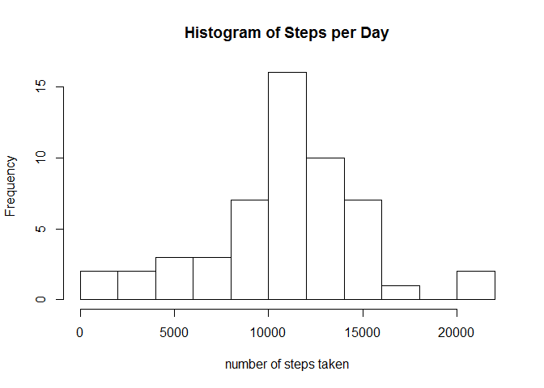
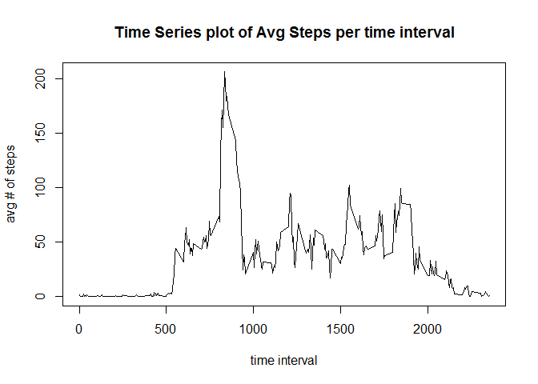
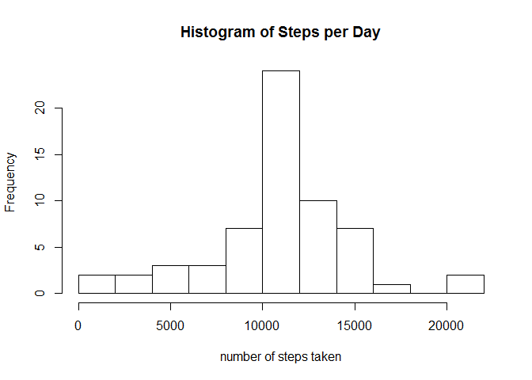
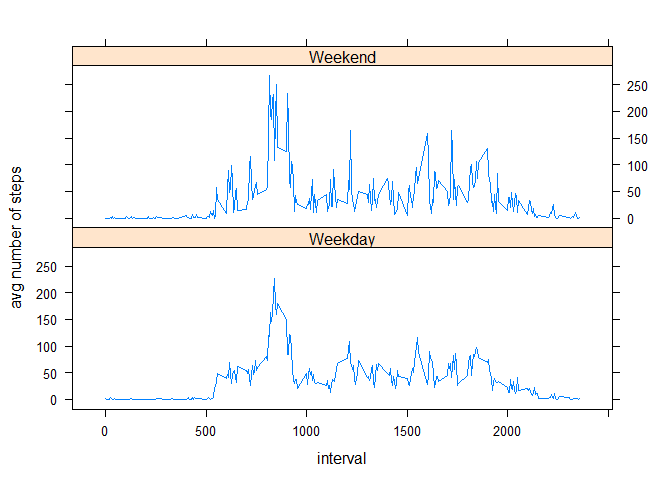

# PA1_template
J. Hartsfield  
October 13, 2015  

## Loading and preprocessing the data
Read in activity.csv file

```r
activity <- read.csv("activity.csv",colClasses=c("numeric","Date","numeric"))
# keep only rows without NA in steps field
activityNoNA <- activity[which(!is.na(activity$steps)),]
```
## Compute the mean number of steps taken per day

We will ignore the missing values in the dataset. 
Calculate the total number of steps taken per day and make a histogram of the total number of steps taken each day

```r
# load in plyr library
library(plyr)
```

```
## Warning: package 'plyr' was built under R version 3.2.2
```

```r
# compute number of total number of steps for each day
a3 <- ddply(activityNoNA,"date",summarize,sumSteps=sum(steps) )
hist(a3$sumSteps,10,xlab="number of steps taken", main="Histogram of Steps per Day")
```

 

```r
mean(a3$sumSteps)
```

```
## [1] 10766.19
```

```r
median(a3$sumSteps)
```

```
## [1] 10765
```

## What is the average daily activity pattern?

```r
# find the average number of steps per time interval
a4 <- ddply(activityNoNA,"interval",summarize,avgSteps=mean(steps) )
# find the interval with the maximum average Steps
a4$interval[which.max(a4$avgSteps)]
```

```
## [1] 835
```
    Make a time series plot (i.e. type = "l") of the 5-minute interval (x-axis) and the average number of steps taken, averaged across all days (y-axis)

```r
plot(a4$interval,a4$avgSteps,type="l",xlab="time interval",ylab="avg # of steps", main="Time Series plot of Avg Steps per time interval")
```

 

   
## Imputing missing values

There are a number of days/intervals where there are missing values (coded as NA). The presence of missing days may introduce bias into some calculations or summaries of the data.

Calculate and report the total number of missing values in the dataset (i.e. the total number of rows with NAs)

```r
sum(is.na(activity$steps))
```

```
## [1] 2304
```

I will fill in all of the missing values in the dataset with the mean for that 5-minute interval and create a new dataset that is equal to the original dataset but with the missing data filled in. Below is a histogram of the total number of steps taken each day with the values filled in. The mean and median total number of steps taken per day do not differ significantly from those previously computed.  The mean is now the same as the median.  There appears to be little  impact of imputing missing data on the estimates of the total daily number of steps.


```r
# replace NA values in activity$steps with the value from a4 which is the mean for the interval
activity$steps <- ifelse(is.na(activity$steps),a4$avgSteps[match(activity$interval,a4$interval)],activity$steps)
# find the total steps taken per day with NAs replace with avg values
a5 <- ddply(activity,"date",summarize,sumSteps=sum(steps) )
hist(a5$sumSteps,10,xlab="number of steps taken", main="Histogram of Steps per Day")
```

 

```r
mean(a5$sumSteps)
```

```
## [1] 10766.19
```

```r
median(a5$sumSteps)
```

```
## [1] 10766.19
```
    
## Are there differences in activity patterns between weekdays and weekends?

Create a new factor variable in the dataset with two levels - "weekday" and "weekend" indicating whether a given date is a weekday or weekend day. Make a panel plot containing a time series plot of the 5-minute interval (x-axis) and the average number of steps taken, averaged across all weekday days or weekend days (y-axis).

```r
wkend <- c("Saturday", "Sunday") 
# add a new field to activity data table with TRUE if it is weekend date, FALSE for weekday
activity$Weekend <- weekdays(a5$date) %in% wkend
# find the average number of steps per time interval
a6 <- ddply(activity,c("interval","Weekend"),summarize,avgSteps=mean(steps) )
# Panel plot of Weekend and Weekday plots
library(lattice)
```

```
## Warning: package 'lattice' was built under R version 3.2.2
```

```r
a6$Weekend <- ifelse(a6$Weekend,"Weekend","Weekday") # change from TRUE FALSE to Weekend or Weekday
xyplot(a6$avgSteps ~ a6$interval| a6$Weekend,type="l",layout=c(1,2),xlab="interval", ylab="avg number of steps")
```

 
